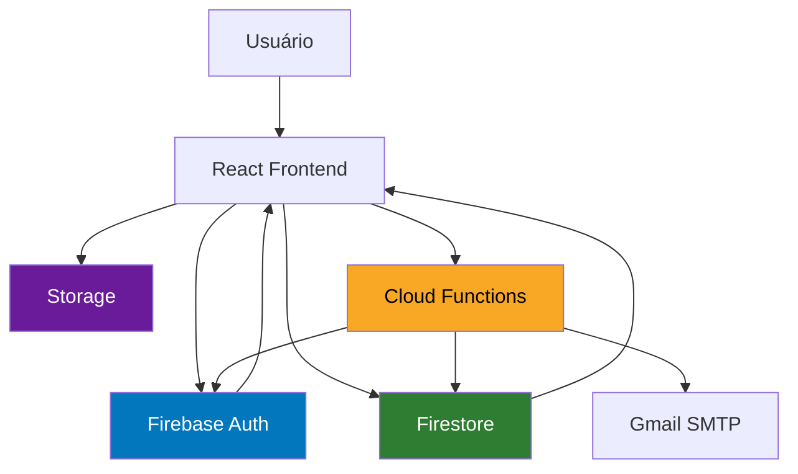
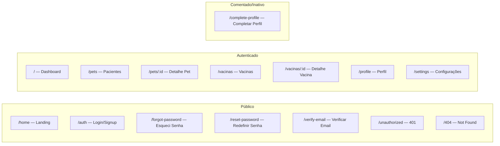
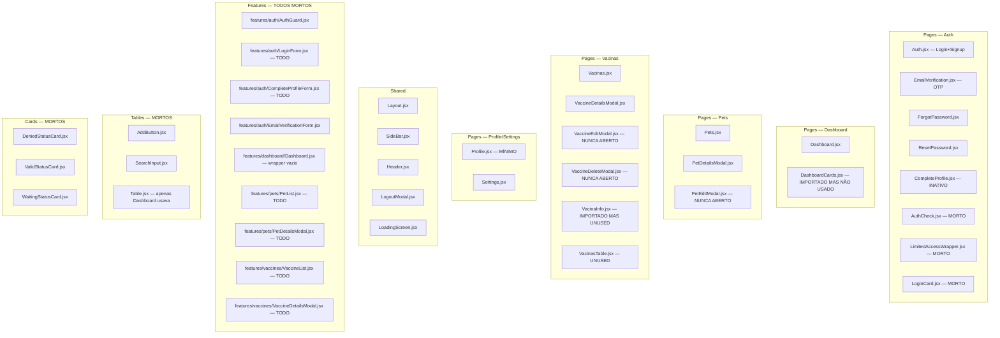
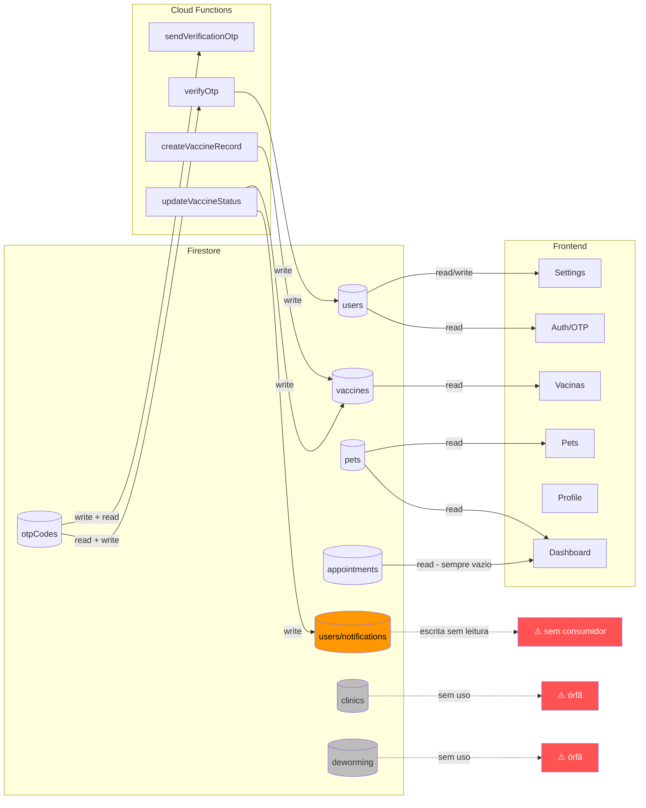
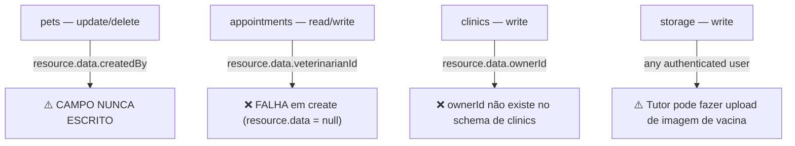
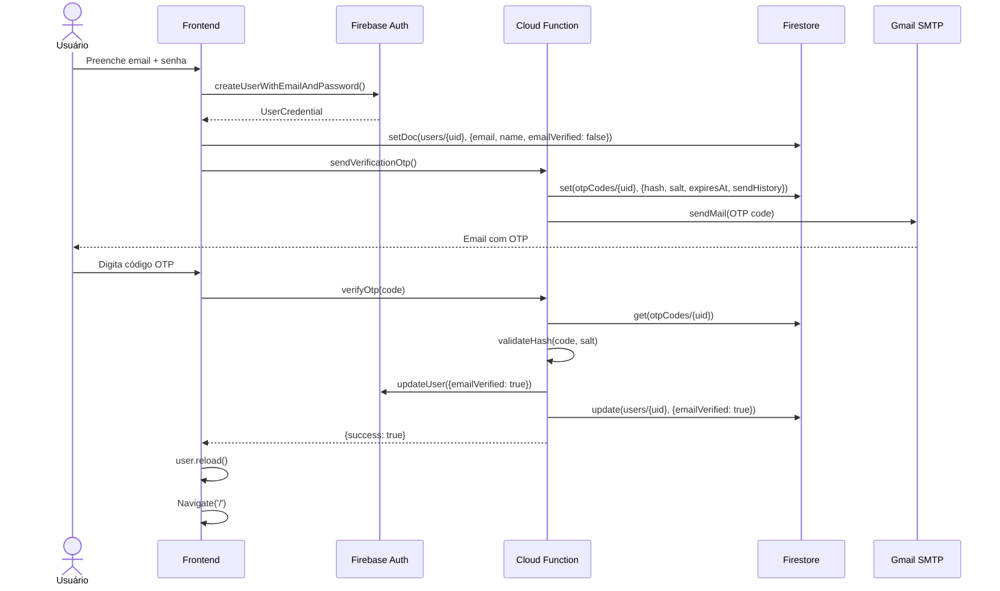

# AUDITORIA COMPLETA DO SISTEMA — Pets Platform
**Data:** 2026-06-02 | **Auditor:** Staff Engineer | **Versão da App:** 3.3.0

---

## Índice

1. [Arquitetura Atual](#1-arquitetura-atual)
2. [Mapeamento Firestore](#2-mapeamento-firestore)
3. [Mapeamento Frontend](#3-mapeamento-frontend)
4. [Análise Firebase (Auth · Storage · Functions · Rules)](#4-análise-firebase)
5. [Mapa Firestore → Frontend](#5-mapa-firestore--frontend)
6. [Relatório de Cobertura de Funcionalidades](#6-relatório-de-cobertura-de-funcionalidades)
7. [Inconsistências e Problemas](#7-inconsistências-e-problemas)
8. [Recomendações Priorizadas](#8-recomendações-priorizadas)

---

## 1. Arquitetura Atual

### Stack

| Camada | Tecnologia |
|---|---|
| Frontend | React 18.2 + CRA (react-scripts 5) |
| Roteamento | React Router v6 |
| Estilos | Tailwind CSS 3.4 + CSS custom properties |
| State global | React Context (AuthContext, ThemeContext) |
| Auth | Firebase Authentication v10 |
| Banco de dados | Firebase Firestore v10 |
| Storage | Firebase Storage |
| Backend | Firebase Cloud Functions (Node.js 22, 2nd Gen) |
| Email | Nodemailer via Gmail SMTP |
| Icons | Lucide React + React Icons |

### Fluxo de Dados Global



---

## 2. Mapeamento Firestore

### 2.1 Collections Existentes

```mermaid
erDiagram
    USERS {
        string email
        string name
        string cpf
        string phone
        boolean profileCompleted
        string role
        string status
        timestamp createdAt
        timestamp updatedAt
        object address
        string crmv
        array specialties
        number yearsOfExperience
        string clinicId
        array pets
        string preferredVetId
        object emergencyContact
        boolean notifications
        boolean darkMode
        string language
        boolean twoFactorAuth
        boolean emailVerified
        string photoURL
    }

    VACCINES {
        string name
        string manufacturer
        string batchNumber
        timestamp expirationDate
        timestamp administrationDate
        timestamp nextDueDate
        string petId
        string petName
        string petSpecies
        string petBreed
        number petWeight
        string ownerId
        string ownerName
        string ownerContact
        string veterinarianId
        string veterinarianName
        string crmvNumber
        string clinicName
        string clinicCnpj
        object clinicAddress
        string status
        object validationDetails
        string labelImage
        object labelImageMetadata
        string notes
        timestamp createdAt
        timestamp updatedAt
    }

    PETS {
        string name
        string species
        string breed
        timestamp birthDate
        string color
        string gender
        number weight
        boolean isNeutered
        string chipNumber
        string ownerId
        string ownerName
        array vaccines
        array veterinarians
        string status
        timestamp createdAt
        timestamp updatedAt
        string createdBy
        string tutorId
        array emergencyContacts
        string medicalNotes
        array allergies
        string chronicConditions
    }

    APPOINTMENTS {
        string petId
        string tutorId
        string veterinarianId
        string clinicId
        timestamp date
        string type
        string status
        string notes
        timestamp createdAt
        timestamp updatedAt
    }

    CLINICS {
        string name
        string cnpj
        string phone
        string email
        object address
        array veterinarians
        string status
        timestamp createdAt
        timestamp updatedAt
    }

    DEWORMING {
        string name
        string manufacturer
        string dosage
        timestamp administrationDate
        timestamp nextDueDate
        string petId
        string petName
        string ownerId
        string veterinarianId
        string status
        timestamp createdAt
    }

    OTP_CODES {
        string hash
        string salt
        timestamp expiresAt
        number attempts
        boolean used
        string email
        timestamp createdAt
        array sendHistory
    }

    NOTIFICATIONS {
        string type
        string vaccineId
        string status
        boolean read
        timestamp createdAt
    }

    USERS ||--o{ NOTIFICATIONS : "subcollection"
    PETS ||--o{ VACCINES : "petId"
    USERS ||--o{ PETS : "veterinarians[]"
    USERS ||--o{ APPOINTMENTS : "veterinarianId"
    CLINICS ||--o{ APPOINTMENTS : "clinicId"
    OTP_CODES ||--|| USERS : "uid (doc id)"
```



### 2.2 Collections — Status de Uso

| Collection | Leitura (App) | Escrita (App) | Escrita (CF) | Status |
|---|---|---|---|---|
| `users` | ✅ useUser, AuthContext | ✅ authService, useUser | ✅ verifyOtp | **Ativa** |
| `users/{id}/notifications` | ❌ **NUNCA** | ❌ notificationService (morto) | ✅ updateVaccineStatus | **Escrita sem leitura** |
| `vaccines` | ✅ useVetVaccines | ⚠️ apenas via CF (createVaccineRecord) | ✅ createVaccineRecord, updateVaccineStatus | **Ativa (parcial)** |
| `pets` | ✅ usePets, useDashboard | ❌ **NUNCA** | ❌ | **Somente leitura** |
| `otpCodes` | ❌ (Admin SDK) | ❌ (Admin SDK) | ✅ sendVerificationOtp, verifyOtp | **Ativa (CF-only)** |
| `appointments` | ✅ useDashboard | ❌ **NUNCA** | ❌ | **Lida sem escrita** |
| `clinics` | ❌ **NUNCA** | ❌ **NUNCA** | ❌ | **⚠️ ÓRFÃ** |
| `deworming` | ❌ **NUNCA** | ❌ **NUNCA** | ❌ | **⚠️ ÓRFÃ** |

### 2.3 Campos — Lidos vs Escritos vs Nunca Usados

#### Collection `users`

| Campo | Escrito | Lido | Observação |
|---|---|---|---|
| `email` | ✅ authService | ✅ Header, Settings | OK |
| `name` | ✅ authService, Settings | ✅ Dashboard, SideBar | OK |
| `emailVerified` | ✅ verifyOtp CF | ✅ AuthContext | OK |
| `role` | ✅ Settings | ✅ SideBar, Settings | OK |
| `crmv` | ✅ Settings | ✅ SideBar, Header | OK |
| `address.*` | ✅ Settings | ✅ Settings | OK |
| `specialties` | ✅ Settings | ✅ Settings | OK |
| `notifications` | ✅ Settings | ❌ **nunca lido** | Salvo mas sem uso |
| `darkMode` | ✅ Settings | ✅ ThemeContext | OK |
| `language` | ✅ Settings | ❌ **nunca lido** | Salvo mas sem uso |
| `twoFactorAuth` | ✅ Settings | ❌ **nunca lido** | Toggle sem implementação |
| `profileCompleted` | ❌ **nunca escrito** | ❌ **nunca lido** | Planejado, não implementado |
| `status` | ❌ **nunca escrito** | ❌ **nunca lido** | Schema só |
| `pets[]` | ❌ **nunca escrito** | ❌ **nunca lido** | Schema só (tutor) |
| `preferredVetId` | ❌ **nunca escrito** | ❌ **nunca lido** | Schema só (tutor) |
| `emergencyContact` | ✅ Settings (tutor) | ❌ **nunca lido** | Salvo sem tela de exibição |
| `clinicId` | ✅ Settings | ❌ **nunca lido para query** | Salvo mas sem JOIN |
| `yearsOfExperience` | ✅ Settings | ❌ **nunca exibido** | Salvo sem tela de exibição |
| `photoURL` | ✅ authService (Google) | ❌ não exibido | Avatar usa inicial |
| `phone` | ✅ Settings | ❌ **nunca exibido** | Salvo sem tela de exibição |
| `cpf` | ✅ Settings | ❌ **nunca exibido** | Sensível, salvo sem display |
| `createdAt` | ✅ authService | ❌ não exibido | OK como metadata |
| `updatedAt` | ✅ useUser | ❌ não exibido | OK como metadata |

#### Collection `vaccines`

| Campo | Escrito | Lido | Observação |
|---|---|---|---|
| `name` | ✅ CF | ✅ VaccineDetailsModal | OK |
| `status` | ✅ CF | ✅ VaccinePage, VaccineDetailsModal | OK |
| `veterinarianId` | ✅ CF | ✅ useVetVaccines (query) | OK |
| `petName`, `ownerName` | ✅ CF | ✅ VaccinePage | OK |
| `validationDetails` | ✅ updateVaccineStatus CF | ✅ VaccineDetailsModal | OK |
| `labelImage` | ✅ vaccineService upload | ✅ VaccineDetailsModal | OK |
| `labelImageMetadata.location` | ⚠️ possível via upload | ✅ VaccineDetailsModal (mapa) | GPS não é stripeado |
| `nextDueDate` | ✅ schema | ❌ **nunca exibido na UI** | Campos da vacina não mostram próxima dose |
| `petSpecies`, `petBreed` | ✅ schema | ❌ **nunca exibidos** | Redundância desnormalizada |
| `ownerContact` | ✅ schema | ❌ **nunca exibido** | PII armazenado mas não exibido |
| `clinicCnpj` | ✅ schema | ❌ **nunca exibido** | Armazenado, não exibido |
| `validationDetails.tutorValidation` | ❌ **nunca escrito** | ❌ **nunca lido** | Fluxo de aprovação do tutor não implementado |

#### Collection `pets`

| Campo | Escrito | Lido | Observação |
|---|---|---|---|
| `name`, `species`, `breed` | ❌ UI | ✅ Pets.jsx | Não há tela de cadastro de pet |
| `veterinarians[]` | ❌ UI | ✅ usePets (query) | Quem popula esse array? |
| `birthDate` | ❌ UI | ✅ Dashboard, Pets | Calculado para idade |
| `status` | ❌ UI | ✅ Dashboard | Nunca setado pela UI |
| `color`, `gender`, `isNeutered` | ❌ UI | ✅ PetDetailsModal | Não há tela de edição funcional |
| `chipNumber` | ❌ UI | ✅ PetDetailsModal | |
| `medicalNotes`, `allergies`, `chronicConditions` | ❌ UI | ❌ **nunca lidos** | Schema só |
| `tutorId` | ❌ UI | ❌ **nunca lido** | Duplica `ownerId` |
| `emergencyContacts[]` | ❌ UI | ❌ **nunca lidos** | Schema só |
| `createdBy` | ❌ UI | ❌ | Regra de segurança depende disso, mas nunca é escrito |

---

## 3. Mapeamento Frontend

### 3.1 Todas as Telas



### 3.2 Todos os Componentes



### 3.3 Operações CRUD por Tela

| Tela | Create | Read | Update | Delete | Collections |
|---|---|---|---|---|---|
| Dashboard | ❌ | ✅ | ❌ | ❌ | `pets`, `appointments` |
| Pets | ❌ | ✅ | ❌ | ❌ | `pets` |
| PetDetailsModal | ❌ | ✅ | ❌ | ❌ | `pets` (via prop) |
| PetEditModal | ❌ | ⚠️ recebe prop | ❌ | ❌ | — (nunca aberto) |
| Vacinas | ❌ | ✅ | ❌ | ❌ | `vaccines` |
| VaccineDetailsModal | ❌ | ✅ | ✅ (via CF) | ❌ | `vaccines`, `users` |
| VaccineEditModal | ❌ | ⚠️ recebe prop | ❌ | ❌ | — (nunca aberto) |
| VaccineDeleteModal | ❌ | ❌ | ❌ | ❌ | — (handler vazio) |
| Profile | ❌ | ⚠️ só Firebase Auth | ❌ | ❌ | — |
| Settings | ❌ | ✅ | ✅ | ❌ | `users` |
| Auth | ❌ | ❌ | ❌ | ❌ | (usa authService) |
| CompleteProfile | — | ✅ | ✅ | ❌ | `users` (INATIVO) |

---

## 4. Análise Firebase

### 4.1 Firebase Authentication

| Método | Implementado | Funcionando |
|---|---|---|
| Email/Password signup | ✅ | ✅ |
| Email/Password login | ✅ | ✅ |
| Google OAuth | ✅ | ✅ |
| Email Verification (OTP custom) | ✅ | ✅ |
| Password Reset | ✅ | ✅ |
| Token Refresh | Automático (Firebase SDK) | ✅ |
| Multi-Factor Auth (TOTP) | ⚠️ UI toggle existe | ❌ não implementado |
| Account deletion | ❌ | ❌ |
| Email change | ❌ | ❌ |

### 4.2 Firebase Storage

```
vaccine-labels/
  {timestamp}_{filename}    ← imagens de etiquetas de vacinas
```

| Funcionalidade | Status |
|---|---|
| Upload de imagem de vacina | ✅ com EXIF stripping |
| Download/visualização | ✅ via URL direto |
| Deleção de imagens | ❌ ao deletar vacina, imagem não é removida do Storage |
| Regra de tamanho (5MB) | ✅ |
| Regra de tipo (image/*) | ✅ |
| Verificação se uploader é veterinário | ❌ apenas autenticado |

### 4.3 Cloud Functions (2nd Gen, southamerica-east1)

| Função | Trigger | Status | Descrição |
|---|---|---|---|
| `sendVerificationOtp` | Callable | ✅ | Gera e envia OTP por email, rate-limited |
| `verifyOtp` | Callable | ✅ | Valida OTP, marca emailVerified |
| `createVaccineRecord` | Callable | ✅ código | ⚠️ sem UI que chame |
| `updateVaccineStatus` | Callable | ✅ | Valida e atualiza status de vacina |

**Análise de `createVaccineRecord`**: A Cloud Function existe e está deployada, mas nenhuma tela do frontend chama `createVaccineRecord`. O `VaccineController.createVaccineRecord` chama a função, mas `VaccineController` também não é invocado por nenhum componente.

### 4.4 Security Rules

#### Firestore Rules — Problemas Identificados

```
✅ otpCodes: allow read, write: if false  (correto)
✅ users/{uid}: self-access only          (correto)
✅ users/{uid}/notifications              (correto)
⚠️ pets create: any authenticated user   (sem validação de dados)
⚠️ pets update: resource.data.createdBy  (CAMPO NUNCA ESCRITO pela UI)
❌ appointments: read/write if veterinarianId == uid  (falha em create: resource.data não existe)
❌ clinics: write if resource.data.ownerId  (campo ownerId não está no schema de clinics)
✅ vaccines: estrutura ok
✅ catch-all: deny                         (correto)
```

| Regra | Status | Problema |
|---|---|---|
| `otpCodes` | ✅ Correta | — |
| `users` | ✅ Correta | — |
| `users/notifications` | ✅ Correta | — |
| `pets` create | ⚠️ Permissiva | Qualquer usuário autenticado pode criar |
| `pets` update/delete | ❌ Quebrada | `createdBy` nunca é escrito pela UI |
| `vaccines` | ✅ Correta | — |
| `appointments` | ❌ Quebrada | `resource.data.veterinarianId` não existe em `create` |
| `clinics` | ❌ Quebrada | `resource.data.ownerId` não existe no schema |
| `deworming` | ⚠️ Definida | Collection órfã, regras inúteis |

#### Storage Rules

```
vaccine-labels: authenticated + size<5MB + contentType=image/*
Demais paths: deny all
```

**Problema**: Não verifica se o usuário é veterinário. Qualquer conta verificada pode fazer upload.

---

## 5. Mapa Firestore → Frontend



---

## 6. Relatório de Cobertura de Funcionalidades

### ✅ Implementado Completamente

---

**Funcionalidade: Autenticação com Email/Senha**
- **Status:** Implementado
- **Collections:** `users`, `otpCodes`
- **Telas:** `Auth.jsx`, `EmailVerification.jsx`
- **Cloud Functions:** `sendVerificationOtp`, `verifyOtp`
- **CRUD:** Create (signup) + Read (login)
- **Observação:** Completo e bem implementado com rate limiting, HMAC hash, OTP expiração de 10min

---

**Funcionalidade: Autenticação com Google OAuth**
- **Status:** Implementado
- **Collections:** `users`
- **Telas:** `Auth.jsx`
- **CRUD:** Create-or-read (upsert)
- **Observação:** Funcional

---

**Funcionalidade: Recuperação de Senha**
- **Status:** Implementado
- **Collections:** — (Firebase Auth)
- **Telas:** `ForgotPassword.jsx`, `ResetPassword.jsx`
- **CRUD:** Update (Firebase Auth)

---

**Funcionalidade: Lista de Pacientes (Pets)**
- **Status:** Implementado (somente leitura)
- **Collections:** `pets`
- **Telas:** `Pets.jsx`, `PetDetailsModal.jsx`
- **CRUD:** Read only
- **Problema:** Não há como criar ou editar pets via UI. O `PetEditModal` existe mas nunca é aberto.

---

**Funcionalidade: Lista de Vacinas**
- **Status:** Implementado (somente leitura + validação)
- **Collections:** `vaccines`
- **Telas:** `Vacinas.jsx`, `VaccineDetailsModal.jsx`
- **Cloud Functions:** `updateVaccineStatus`
- **CRUD:** Read + partial Update (validação vet)

---

**Funcionalidade: Validação de Vacina pelo Veterinário**
- **Status:** Implementado
- **Collections:** `vaccines`, `users/notifications`
- **Telas:** `VaccineDetailsModal.jsx`
- **Cloud Functions:** `updateVaccineStatus`
- **CRUD:** Update (status + validationDetails.vetValidation)
- **Problema:** Aprovação pelo tutor (`tutorValidation`) nunca implementada. Notificação gravada mas nunca lida.

---

**Funcionalidade: Configurações do Perfil**
- **Status:** Implementado (parcialmente útil)
- **Collections:** `users`
- **Telas:** `Settings.jsx` (abas: Perfil, Endereço, Profissional, Sistema)
- **CRUD:** Read + Update
- **Observação:** Salva muitos campos que nunca são exibidos em outros lugares (`phone`, `cpf`, `emergencyContact`, `language`, `twoFactorAuth`)

---

**Funcionalidade: Dark Mode**
- **Status:** Implementado
- **Collections:** `users` (campo `darkMode`)
- **Telas:** `Settings.jsx` toggle + `ThemeContext`
- **CRUD:** Read + Update

---

### ⚠️ Parcialmente Implementado

---

**Funcionalidade: Dashboard / Visão Geral**
- **Status:** Parcialmente implementado
- **Collections:** `pets`, `appointments`
- **Telas:** `Dashboard.jsx`
- **CRUD:** Read only
- **Problema:**
  - `appointments` sempre retorna 0 (nenhum agendamento pode ser criado)
  - `criticalCases` sempre 0 (campo `status: 'critical'` nunca é gravado)
  - `recentPets` depende de `lastVisit` que nunca é gravado
  - KPI "Consultas Hoje" sempre mostra 0

---

**Funcionalidade: Cadastro de Vacina**
- **Status:** Parcialmente implementado
- **Collections:** `vaccines`
- **Cloud Functions:** `createVaccineRecord` (deployada)
- **Telas:** Nenhuma — `VaccineController` existe mas não é chamado por nenhum componente
- **Problema:** Backend completamente pronto (CF com validação de CPF/CRMV, Storage upload), frontend sem formulário de cadastro

---

**Funcionalidade: Perfil do Usuário**
- **Status:** Parcialmente implementado
- **Collections:** — (só Firebase Auth)
- **Telas:** `Profile.jsx`
- **Problema:** Exibe apenas o email do Firebase Auth. Os dados do Firestore (nome, CRMV, foto) não são exibidos. A tela é essencialmente vazia.

---

**Funcionalidade: Notificações**
- **Status:** Parcialmente implementado
- **Collections:** `users/{uid}/notifications`
- **Telas:** Header tem ícone de sino mas sem painel de notificações
- **Problema:** `updateVaccineStatus` grava notificações no Firestore. Nenhum hook lê essa subcollection. O sino no Header é decorativo e mostra toast "em desenvolvimento".

---

**Funcionalidade: Edição de Vacina**
- **Status:** Parcialmente implementado
- **Collections:** `vaccines`
- **Telas:** `VaccineEditModal.jsx` (existe, tem form completo)
- **Problema:** Nunca é aberto. `handleEditClick` em `Vacinas.jsx` seta o estado mas não há botão de editar na tabela.

---

**Funcionalidade: Deleção de Vacina**
- **Status:** Parcialmente implementado
- **Collections:** `vaccines`
- **Telas:** `VaccineDeleteModal.jsx` (existe)
- **Problema:** O `handleDelete` em `Vacinas.jsx` tem `console.log` sem implementação real. Imagem no Storage não seria deletada.

---

### ❌ Não Implementado (Planejado no Schema)

---

**Funcionalidade: Cadastro de Pets**
- **Status:** Não implementado
- **Collections:** `pets` (schema definido)
- **Telas:** Nenhuma tela de criação
- **Problema:** Como os dados de pets chegam ao Firestore? Não há fluxo de cadastro.

---

**Funcionalidade: Agendamentos (Appointments)**
- **Status:** Não implementado
- **Collections:** `appointments` (schema definido, regras definidas)
- **Telas:** Nenhuma
- **Problema:** Dashboard consulta esta collection mas ela estará sempre vazia.

---

**Funcionalidade: Clínicas**
- **Status:** Não implementado
- **Collections:** `clinics` (schema definido, regras definidas)
- **Telas:** Nenhuma

---

**Funcionalidade: Vermifugação (Deworming)**
- **Status:** Não implementado
- **Collections:** `deworming` (schema definido, regras definidas)
- **Telas:** Nenhuma

---

**Funcionalidade: Completar Perfil (Onboarding)**
- **Status:** Não implementado
- **Telas:** `CompleteProfile.jsx` (512 linhas, rota comentada em `App.jsx`)
- **Problema:** Componente completo mas inacessível. Usuários veterinários que se cadastram não têm fluxo de completar CRMV/especialidades.

---

**Funcionalidade: Aprovação pelo Tutor**
- **Status:** Não implementado
- **Collections:** `vaccines.validationDetails.tutorValidation`
- **Problema:** Schema prevê dupla aprovação (vet + tutor), mas o fluxo do tutor nunca foi construído. Nenhuma rota, tela ou conta de tutor existe na UI.

---

**Funcionalidade: 2FA (TOTP)**
- **Status:** Não implementado
- **Telas:** `Settings.jsx` (toggle existe)
- **Problema:** Toggle salva `twoFactorAuth: true` no Firestore mas Firebase Auth MFA não está configurado.

---

**Funcionalidade: Idioma**
- **Status:** Não implementado
- **Telas:** `Settings.jsx` (select existe)
- **Problema:** Salva `language` no Firestore mas a app está 100% em português sem i18n.

---

## 7. Inconsistências e Problemas

### 7.1 Componentes e Arquivos Mortos

| Arquivo | Problema | Impacto |
|---|---|---|
| `src/features/**` | 9 arquivos, todos TODOs ou vazios | Confusão arquitetural |
| `src/components/auth/RouteGuard.jsx` | Nunca importado | Código morto |
| `src/components/auth/AuthCheck.jsx` | Nunca importado | Código morto |
| `src/components/pages/Auth/AuthCheck.jsx` | Nunca importado | Código morto |
| `src/components/pages/Auth/LimitedAccessWrapper.jsx` | Nunca importado | Código morto |
| `src/components/pages/Auth/Login/components/LoginCard.jsx` | Nunca importado | Código morto |
| `src/components/tables/AddButton.jsx` | Nunca importado | Código morto |
| `src/components/tables/SearchInput.jsx` | Nunca importado | Código morto |
| `src/components/cards/*.jsx` | Nunca importados (3 arquivos) | Código morto |
| `src/features/dashboard/components/Dashboard.jsx` | Wrapper vazio | Código morto |
| `src/components/pages/Dashboard/components/DashboardCards.jsx` | Nunca importado pelo Dashboard atual | Código morto |
| `VaccineEditModal.jsx` | Nunca aberto | Funcionalidade morta |
| `VaccineDeleteModal.jsx` | `handleDelete` é `console.log` | Funcionalidade morta |
| `PetEditModal.jsx` | Nunca aberto | Funcionalidade morta |

### 7.2 Estruturas Duplicadas

| Estrutura | Duplicatas | Ativa |
|---|---|---|
| Layout | `src/components/shared/Layout/` + `src/components/layout/` | `shared/` |
| SideBar | `src/components/shared/SideBar/` + `src/components/layout/Sidebar/` | `shared/` |
| Header | `src/components/shared/Header/` + `src/components/layout/Header/` | `shared/` |
| Dashboard | `src/components/pages/Dashboard/` + `src/features/dashboard/` | `pages/` |
| PetDetailsModal | `src/components/pages/Pets/` + `src/features/pets/` | `pages/` |
| VaccineDetailsModal | `src/components/pages/Vacinas/` + `src/features/vaccines/` | `pages/` |
| useAuth | `src/hooks/useAuth.js` + `src/context/AuthContext.jsx` | `AuthContext` |

### 7.3 Campos Duplicados / Desnormalizados sem Estratégia

| Dados | Localização 1 | Localização 2 | Problema |
|---|---|---|---|
| Nome do pet | `pets.name` | `vaccines.petName` | Atualização do nome do pet não propaga |
| CRMV | `users.crmv` | `vaccines.crmvNumber` | Mudança de CRMV não atualiza vacinas |
| Nome do veterinário | `users.name` | `vaccines.veterinarianName` | Idem |
| Nome do tutor | `users.name` | `vaccines.ownerName` | Idem |
| ownerId vs tutorId | `pets.ownerId` + `pets.tutorId` | — | Dois campos para a mesma coisa |
| emailVerified | `users.emailVerified` | Firebase Auth `user.emailVerified` | Dois locais, podem dessincronizar |

### 7.4 Problemas de Segurança (Regras Firestore)



### 7.5 Collections Órfãs

| Collection | Schema | Regras | Uso |
|---|---|---|---|
| `clinics` | ✅ | ✅ | ❌ |
| `deworming` | ✅ | ✅ | ❌ |
| `rateLimits` | ❌ | ❌ | ❌ (Rate limiter em memória no CF) |

### 7.6 Dados Nunca Lidos

| Campo | Collection | Impacto |
|---|---|---|
| `notifications.*` | `users/{id}/notifications` | Gravados, nunca exibidos |
| `twoFactorAuth` | `users` | Salvo, nunca processado |
| `language` | `users` | Salvo, nunca aplicado |
| `profileCompleted` | `users` | Campo no schema, nunca escrito/lido |
| `status` | `users` | Campo no schema, nunca escrito/lido |
| `pets[]` | `users` (tutor) | Campo no schema, nunca escrito/lido |
| `medicalNotes`, `allergies`, `chronicConditions` | `pets` | Schema só |
| `emergencyContacts[]` | `pets` | Schema só |
| `nextDueDate` | `vaccines` | Salvo, nunca exibido |
| `petSpecies`, `petBreed` (em vaccines) | `vaccines` | Desnormalizados mas não exibidos |

---

## 8. Recomendações Priorizadas

### 🔴 Alta Prioridade

| # | Problema | Ação | Esforço |
|---|---|---|---|
| 1 | **Regras Firestore quebradas** (`pets.createdBy`, `appointments`, `clinics`) | Reescrever regras para `appointments` e `clinics`; adicionar `createdBy` na escrita de pets | Baixo |
| 2 | **Dashboard sempre mostra zeros** (`appointments` vazio, `criticalCases` sempre 0) | Criar fluxo de cadastro de agendamentos OU remover KPIs não funcionais | Médio |
| 3 | **Sem fluxo de cadastro de Pet** | Criar `PetCreateModal` e conectar ao Firebase. O array `veterinarians` nunca é populado. | Alto |
| 4 | **VaccineDeleteModal sem implementação** | Implementar deleção no `vaccineService` + remover imagem do Storage | Baixo |
| 5 | **`pets.createdBy` nunca gravado** | Adicionar `createdBy: auth.uid` em toda escrita de pet | Baixo |
| 6 | **Storage sem verificação de role** | Adicionar regra: uploader deve ter `role = 'veterinarian'` via Firestore check | Baixo |

### 🟡 Média Prioridade

| # | Problema | Ação | Esforço |
|---|---|---|---|
| 7 | **Notificações gravadas mas nunca lidas** | Criar componente de painel de notificações no Header | Médio |
| 8 | **Profile.jsx essencialmente vazio** | Exibir dados do Firestore (`name`, `crmv`, `role`, foto) | Baixo |
| 9 | **CompleteProfile.jsx inacessível** | Reativar rota + adicionar redirecionamento após signup para completar perfil | Médio |
| 10 | **`ownerId` vs `tutorId` duplicados em pets** | Remover `tutorId`, usar só `ownerId` | Baixo |
| 11 | **VaccineEditModal nunca aberto** | Adicionar botão "Editar" na tabela e implementar o handler de save | Baixo |
| 12 | **Desnormalização sem propagação** | Documentar explicitamente que `petName`, `ownerName` em vaccines são snapshots imutáveis | Baixo |
| 13 | **Imagem não deletada quando vacina é deletada** | Adicionar Cloud Function trigger no delete OU deletar manualmente no handler | Médio |

### 🟢 Baixa Prioridade

| # | Problema | Ação | Esforço |
|---|---|---|---|
| 14 | **9+ arquivos mortos em `src/features/`** | Deletar o diretório `src/features/` ou migrar o código útil | Baixo |
| 15 | **Estruturas duplicadas (Layout, SideBar, Header)** | Deletar as duplicatas em `src/components/layout/` | Baixo |
| 16 | **`useAuth.js` em hooks/ duplica AuthContext** | Remover `src/hooks/useAuth.js`; usar só `useAuth` do AuthContext | Baixo |
| 17 | **Campos `notifications`, `language`, `twoFactorAuth` sem uso** | Implementar ou remover do form de Settings | Médio |
| 18 | **`appointments` e `clinics` órfãs** | Implementar ou remover schema + regras | Alto |
| 19 | **`deworming` completamente não implementado** | Implementar ou remover schema + regras | Alto |
| 20 | **Rate limiter de CF em memória** | Migrar para Firestore (já identificado em auditorias anteriores) | Médio |

---

## Apêndice — Fluxo de Dados Atual (Sequência de Login)



---

*Relatório gerado em 2026-06-02. Baseado na análise de 47 arquivos de código-fonte, schema Firestore, security rules e Cloud Functions.*
