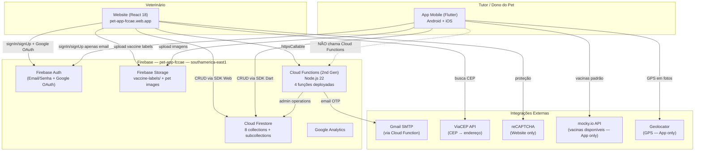
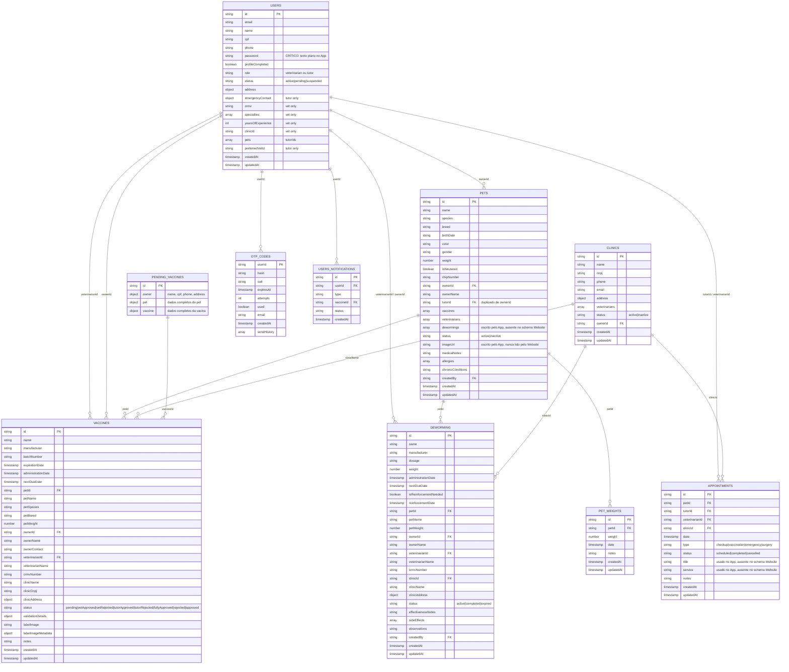
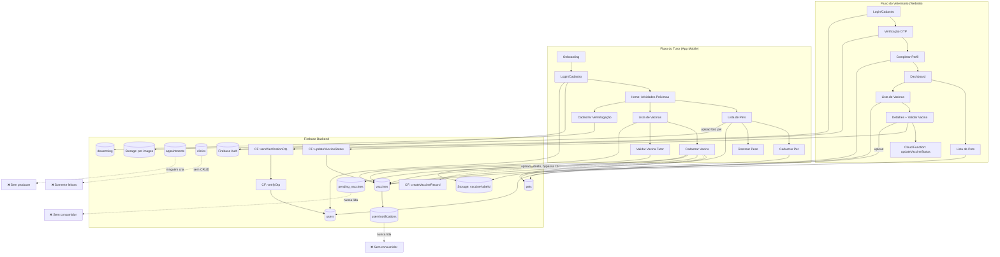
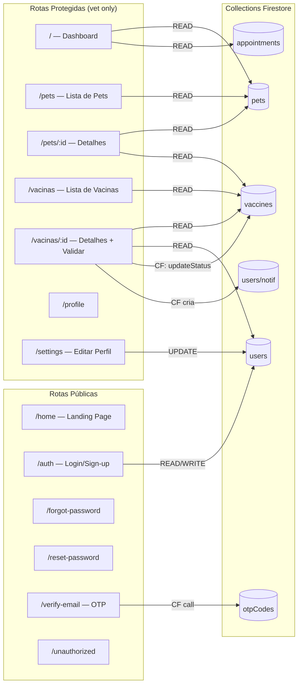
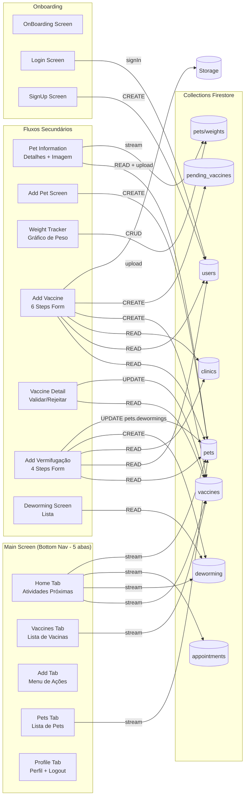
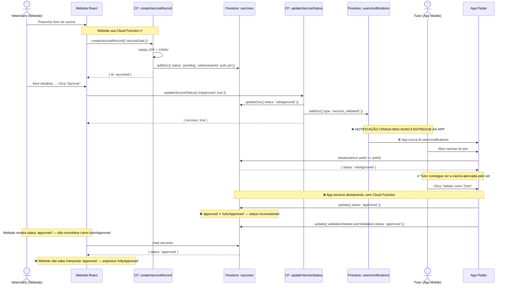
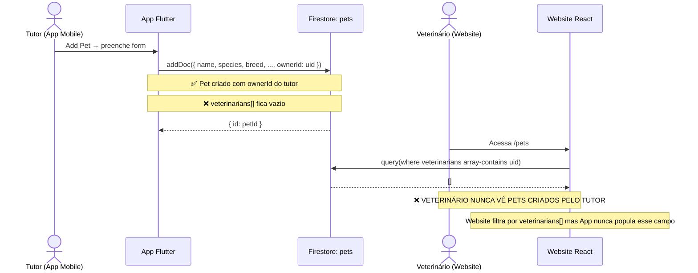
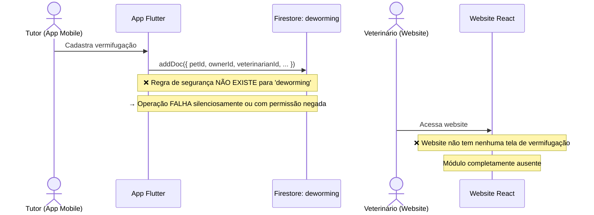
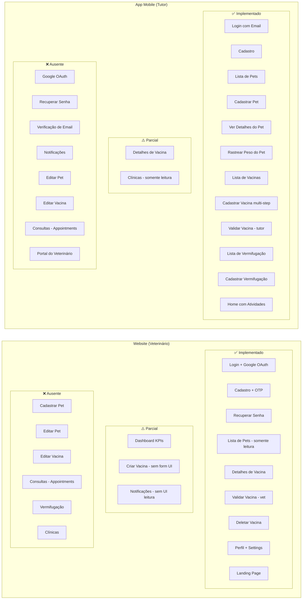

# Auditoria Completa do Sistema Multi-Plataforma — Pets App

**Data:** 2026-06-03 | **Versão Website:** 3.3.0 | **Projeto Firebase:** pet-app-fccae  
**Website:** https://pet-app-fccae.web.app | **Região:** southamerica-east1

---

## Sumário Executivo

O sistema é composto por duas plataformas que compartilham o mesmo backend Firebase:

| Plataforma | Foco | Tecnologia | Status |
|-----------|------|-----------|--------|
| **Website** | Veterinários e administração | React 18 + Firebase Web SDK | Parcialmente implementado |
| **App Mobile** | Tutores/donos de pets | Flutter + Firebase Dart SDK | Parcialmente implementado |

A auditoria revelou **vulnerabilidades críticas de segurança**, **inconsistências graves de dados entre plataformas** e **funcionalidades incompletas** em ambas as plataformas. O sistema **não está em condições seguras para produção** sem as correções listadas neste relatório.

---

## Índice

1. [Arquitetura Atual do Sistema](#1-arquitetura-atual-do-sistema)
2. [Mapa Firestore — Collections e Relacionamentos](#2-mapa-firestore--collections-e-relacionamentos)
3. [Mapa Completo: Quem Escreve e Quem Lê](#3-mapa-completo-quem-escreve-e-quem-lê)
4. [Fluxo de Dados Global](#4-fluxo-de-dados-global)
5. [Website — Mapeamento Completo](#5-website--mapeamento-completo)
6. [App Mobile — Mapeamento Completo](#6-app-mobile--mapeamento-completo)
7. [Firebase — Análise de Serviços](#7-firebase--análise-de-serviços)
8. [Fluxos Cruzados Entre Plataformas](#8-fluxos-cruzados-entre-plataformas)
9. [Relatório de Cobertura de Funcionalidades](#9-relatório-de-cobertura-de-funcionalidades)
10. [Inconsistências Identificadas](#10-inconsistências-identificadas)
11. [Vulnerabilidades de Segurança](#11-vulnerabilidades-de-segurança)
12. [Recomendações de Refatoração](#12-recomendações-de-refatoração)

---

## 1. Arquitetura Atual do Sistema

### 1.1 Visão Geral



### 1.2 Stack Tecnológico

| Camada | Website | App Mobile |
|--------|---------|-----------|
| Framework | React 18.2 | Flutter (Dart ≥2.19.6) |
| Firebase SDK | firebase@^10.7.2 (Web) | firebase_core@^2.15.0 (Dart) |
| Firestore SDK | cloud_firestore (Web) | cloud_firestore@^4.8.3 |
| Auth SDK | firebase_auth (Web) | firebase_auth@^4.7.0 |
| Storage SDK | firebase_storage (Web) | firebase_storage@^11.2.5 |
| State Management | React Context + Hooks | Provider + StatefulWidget |
| Roteamento | React Router DOM 6.22 | Navigator (imperative) |
| Formulários | React Hook Form 7.54 | StatefulWidget + setState |
| CSS/UI | Tailwind CSS 3.4 | Flutter Widgets |
| Testes | Jest + Playwright | — (não identificados) |

---

## 2. Mapa Firestore — Collections e Relacionamentos

### 2.1 Diagrama ER Completo



---

## 3. Mapa Completo: Quem Escreve e Quem Lê

### 3.1 Collection `users`

| Campo | Escrito por Website | Escrito por App | Escrito por CF | Lido por Website | Lido por App | Observação |
|-------|:-:|:-:|:-:|:-:|:-:|---|
| `email` | ✅ | ✅ | — | ✅ | ✅ | Consistente |
| `name` | ✅ | ✅ | — | ✅ | ✅ | Consistente |
| `cpf` | ✅ | ✅ | — | ✅ Settings | ✅ | Dado sensível sem criptografia |
| `phone` | ✅ | ✅ | — | ✅ Settings | ✅ | |
| `password` | ❌ nunca | ✅ (texto plano!) | — | ❌ | ✅ | **CRÍTICO: App salva senha em texto plano** |
| `profileCompleted` | ✅ | ✅ | ✅ verifyOtp | ✅ AuthContext | ✅ | Consistente |
| `role` | ✅ | ✅ | — | ✅ RouteGuard | ❌ nunca verifica | App não diferencia roles |
| `status` | ✅ | ✅ | — | ✅ | ✅ | |
| `emailVerified` | ❌ | ❌ | ✅ verifyOtp | ✅ | ❌ | App não tem verificação de email |
| `address` | ✅ Settings | ✅ | — | ✅ | ✅ | |
| `crmv` | ✅ CompleteProfile | ❌ | — | ❌ nunca lido | ❌ | Campo nunca lido em nenhuma plataforma |
| `specialties` | ✅ | ❌ | — | ❌ | ❌ | **Órfão: escrito, nunca lido** |
| `yearsOfExperience` | ✅ | ❌ | — | ❌ | ❌ | **Órfão** |
| `clinicId` | ✅ | ❌ | — | ❌ | ❌ | **Órfão** |
| `preferredVetId` | ✅ schema | ❌ | — | ❌ | ❌ | **Órfão** |
| `emergencyContact` | ✅ schema | ✅ | — | ❌ | ✅ | Website não lê |
| `pets` | ❌ | ✅ (array) | — | ❌ | ✅ | Website nunca escreve nem lê esse campo |

### 3.2 Collection `pets`

| Campo | Escrito por Website | Escrito por App | Escrito por CF | Lido por Website | Lido por App | Observação |
|-------|:-:|:-:|:-:|:-:|:-:|---|
| `name` | ❌ nunca cria | ✅ | — | ✅ | ✅ | Website nunca cria pets |
| `species` | ❌ | ✅ | — | ✅ | ✅ | |
| `breed` | ❌ | ✅ | — | ✅ | ✅ | |
| `birthDate` | ❌ | ✅ | — | ✅ | ✅ | |
| `ownerId` | ❌ | ✅ | — | ✅ (filter) | ✅ (filter) | |
| `tutorId` | ❌ | ✅ | — | ❌ | ❌ | **Duplicado de ownerId** |
| `veterinarians` | ❌ | ✅ schema | — | ✅ (array-contains) | ❌ | Website filtra por esse campo mas App nunca popula |
| `imageUrl` | ❌ | ✅ Storage upload | — | ❌ | ✅ | **Gap: Website nunca exibe foto do pet** |
| `status` | ❌ | ✅ | — | ❌ | ✅ filter | Website usa status 'active'/'inactive' mas não filtra por ele |
| `dewormings` | ❌ | ✅ arrayUnion | — | ❌ | ❌ | **Campo escrito pelo App, nunca lido** |
| `allergies` | ❌ | ✅ | — | ❌ | ❌ | Escrito, nunca exibido |
| `chronicConditions` | ❌ | ✅ | — | ❌ | ❌ | Escrito, nunca exibido |
| `emergencyContacts` | ❌ | ✅ | — | ❌ | ❌ | Escrito, nunca exibido |
| `medicalNotes` | ❌ | ✅ | — | ❌ | ❌ | Escrito, nunca exibido |
| `createdBy` | ❌ | ✅ | — | ❌ | ❌ | **CRÍTICO: Regra de segurança do Website verifica esse campo para UPDATE/DELETE mas App não o preenche** |

### 3.3 Collection `vaccines`

| Campo | Escrito por Website | Escrito por App | Escrito por CF | Lido por Website | Lido por App | Observação |
|-------|:-:|:-:|:-:|:-:|:-:|---|
| `name` | ✅ via CF | ✅ direto | CF | ✅ | ✅ | |
| `status` | — | ✅ "approved"/"rejected" | ✅ "vetApproved"/"vetRejected" | ✅ | ✅ | **CRÍTICO: Strings diferentes entre plataformas** |
| `veterinarianId` | — | ✅ (parâmetro não validado) | ✅ = auth.uid | ✅ filter | — | App bypassa validação da CF |
| `labelImage` | ✅ via vaccineService | ✅ label_step.dart | — | ✅ | ✅ | Consistente |
| `labelImageMetadata.location` | ✅ (GPS) | ✅ (GPS) | — | ❌ nunca exibido | ❌ | Coletado mas nunca usado |
| `validationDetails.vetValidation` | — | ❌ nunca escreve | ✅ updateVaccineStatus | ✅ | ✅ | |
| `validationDetails.tutorValidation` | ❌ | ✅ validacao_controller | — | ✅ | ✅ | |
| `clinicCnpj` | ✅ via CF | ✅ | CF | ❌ | ✅ | Website não exibe CNPJ |

### 3.4 Collection `appointments`

| Campo | Escrito por Website | Escrito por App | Lido por Website | Lido por App | Observação |
|-------|:-:|:-:|:-:|:-:|---|
| `veterinarianId` | ❌ | ❌ | ✅ (useDashboard filter) | ❌ | Ninguém cria appointments |
| `tutorId` | ❌ | ❌ | ❌ | ✅ (home filter) | Ninguém cria appointments |
| `title` | ❌ | ❌ | ❌ | ✅ | **Campo lido pelo App mas nunca escrito por ninguém** |
| `service` | ❌ | ❌ | ❌ | ✅ | **Campo lido pelo App mas nunca escrito** |
| `date` | ❌ | ❌ | ✅ | ✅ | Ninguém cria |

### 3.5 Collections Órfãs por Plataforma

| Collection | Website | App Mobile | Status |
|-----------|:-------:|:----------:|--------|
| `clinics` | ❌ nenhuma UI | ✅ apenas leitura (busca vets/clínicas) | Lida pelo App, sem CRUD em nenhuma plataforma |
| `deworming` | ❌ zero | ✅ CRUD completo | **Website não sabe que existe** |
| `pending_vaccines` | ❌ zero | ✅ apenas escrita | **Criada pelo App, nunca lida por ninguém** |
| `otpCodes` | ✅ via CF | ❌ | |
| `users/notifications` | ✅ via CF (escrita) | ❌ nunca lida | **Notificações criadas e nunca consumidas** |

---

## 4. Fluxo de Dados Global

### 4.1 Fluxo Geral Multi-Plataforma



---

## 5. Website — Mapeamento Completo

### 5.1 Mapa de Telas e Collections



### 5.2 Componentes Duplicados — Migração Incompleta

O projeto iniciou migração de `components/pages/` para `features/` mas não concluiu. Resultado: **10 componentes duplicados ativos**.

| Componente | Local Legado | Local Novo | Status |
|-----------|-------------|-----------|--------|
| Dashboard | `components/pages/Dashboard/Dashboard.jsx` | `features/dashboard/Dashboard.jsx` | Duplicado |
| Lista de Pets | `components/pages/Pets/Pets.jsx` | `features/pets/PetList.jsx` | Duplicado |
| Detalhes do Pet | `components/pages/Pets/PetDetailsModal.jsx` | `features/pets/PetDetailsModal.jsx` | Duplicado |
| Lista de Vacinas | `components/pages/Vacinas/Vacinas.jsx` | `features/vaccines/VaccineList.jsx` | Duplicado |
| Detalhes da Vacina | `components/pages/Vacinas/VaccineDetailsModal.jsx` | `features/vaccines/VaccineDetailsModal.jsx` | Duplicado |
| Completar Perfil | `components/pages/Auth/CompleteProfile.jsx` | `features/auth/CompleteProfileForm.jsx` | Duplicado |
| Auth Guard | `components/auth/AuthCheck.jsx` | `features/auth/AuthGuard.jsx` | Duplicado |
| Layout | `components/layout/Layout.jsx` | `components/shared/Layout/Layout.jsx` | Duplicado |
| Header | `components/layout/Header/Header.jsx` | `components/shared/Header/Header.jsx` | Duplicado |
| Sidebar | `components/layout/Sidebar/Sidebar.jsx` | `components/shared/SideBar/SideBar.jsx` | Duplicado |

### 5.3 Operações CRUD por Tela

| Tela | Collection | Create | Read | Update | Delete |
|------|-----------|:------:|:----:|:------:|:------:|
| Auth | `users` | ✅ | ✅ | — | — |
| Email Verification | `otpCodes` (via CF) | CF | CF | CF | — |
| Complete Profile | `users` | — | ✅ | ✅ | — |
| Settings | `users` | — | ✅ | ✅ | — |
| Dashboard | `pets` | — | ✅ | — | — |
| Dashboard | `appointments` | — | ✅ | — | — |
| Pets List | `pets` | — | ✅ | — | — |
| Pet Details | `pets`, `vaccines` | — | ✅ | — | — |
| Pet Edit Modal | `pets` | — | — | ❌ placeholder | — |
| Vaccines List | `vaccines` | — | ✅ | — | — |
| Vaccine Details | `vaccines`, `users` | — | ✅ | CF | — |
| Vaccine Delete | `vaccines` | — | — | — | ✅ |
| Vaccine Edit Modal | `vaccines` | — | — | ❌ placeholder | — |
| Profile | `users` (via Auth) | — | ✅ | — | — |

---

## 6. App Mobile — Mapeamento Completo

### 6.1 Mapa de Telas e Collections



### 6.2 Operações CRUD por Tela

| Tela | Collection | Create | Read | Update | Delete |
|------|-----------|:------:|:----:|:------:|:------:|
| SignUp | `users` | ✅ | — | — | — |
| Home | `vaccines`, `deworming`, `appointments`, `pets` | — | ✅ stream | — | — |
| Pets Screen | `pets` | — | ✅ stream | — | — |
| Add Pet | `pets` | ✅ | — | — | — |
| Pet Information | `pets`, Storage | — | ✅ | ✅ imageUrl | — |
| Pet Weight Tracker | `pets/weights` | ✅ | ✅ stream | ✅ | ✅ |
| Vaccines Screen | `vaccines` | — | ✅ stream | — | — |
| Add Vaccine | `pets`, `users`, `clinics`, `vaccines`, `pending_vaccines`, Storage | ✅ | ✅ | — | — |
| Vaccine Screen | `vaccines` | — | ✅ | ✅ (tutor validate) | — |
| Add Vermifugação | `pets`, `users`, `clinics`, `deworming` | ✅ | ✅ | ✅ pets.dewormings | — |
| Deworming Screen | `deworming` | — | ✅ | — | — |
| Profile | `users` (via Auth) | — | ✅ | — | — |

---

## 7. Firebase — Análise de Serviços

### 7.1 Firebase Authentication

| Funcionalidade | Website | App Mobile | Observação |
|----------------|:-------:|:----------:|-----------|
| Email + Senha | ✅ | ✅ | Ambas implementadas |
| Google OAuth | ✅ | ❌ | Somente Website |
| Apple Sign-In | ❌ | ❌ | firebase_options.dart tem iosClientId mas não implementado |
| Verificação de Email (OTP) | ✅ | ❌ | App não verifica email |
| Recuperação de Senha | ✅ | ❌ | App não tem |
| Reset de Senha | ✅ | ❌ | App não tem |
| Auth State Listener | ✅ `onAuthStateChanged` | ✅ `authStateChanges()` | Ambas |
| Verificação de Role | ✅ `RouteGuard` | ❌ | App não verifica role nem status |
| Verificação de Status (active/pending) | ✅ | ❌ | App permite `pending` acessar tudo |
| Verificação de `profileCompleted` | ✅ | ❌ | App não verifica |
| reCAPTCHA | ✅ importado | ❌ | |

**Problema crítico:** Um veterinário pode instalar o app mobile e usá-lo com as mesmas credenciais. O app não verifica `role`, então um veterinário verá a interface de tutor. Um tutor pode acessar o website sem redirecionamento, pois RouteGuard do website verifica `role == 'veterinarian'` — mas a tela de boas-vindas não indica claramente que o website é para veterinários.

### 7.2 Firebase Storage

| Path | Quem faz Upload | Quem faz Download | Regra | Observação |
|------|:-:|:-:|-------|-----------|
| `vaccine-labels/{timestamp}_{name}` | Website (vaccineService) | Website + App | size < 5MB, image/* | Correto |
| `images/{uniqueFileName}` | App (label_step.dart) | Website + App | Verificar — path diferente | **Paths diferentes entre plataformas para o mesmo conteúdo** |
| `pets/{petId}/...` (provável) | App (pet_information.dart) | App | Não especificado nas rules | **Website nunca lê nem exibe fotos de pets** |

**Inconsistência de path:** O Website usa `vaccine-labels/{timestamp}_{filename}` e o App usa `images/{uniqueFileName}`. Ambos salvam a URL em `vaccines.labelImage` mas os arquivos ficam em locais diferentes, tornando difícil aplicar políticas de storage uniformes.

### 7.3 Cloud Functions — Análise de Uso

| Função | Plataforma que Chama | Status |
|--------|:-:|--------|
| `sendVerificationOtp` | Website only | ✅ Deployada e usada |
| `verifyOtp` | Website only | ✅ Deployada e usada |
| `createVaccineRecord` | Website only | ✅ Deployada — **App bypassa e escreve direto** |
| `updateVaccineStatus` | Website only | ✅ Deployada — **App bypassa e escreve direto** |

**Gap crítico:** O App mobile **não usa nenhuma Cloud Function**. Ele escreve diretamente no Firestore. Isso significa:

1. A validação de CPF (algoritmo Módulo 11) é ignorada pelo App
2. A validação de CRMV (regex) é ignorada pelo App
3. O App pode criar vacinas com qualquer `veterinarianId`, sem verificação
4. O App pode aprovar/rejeitar vacinas sem as proteções da Cloud Function

### 7.4 Security Rules — Análise Crítica

#### Firestore Rules (Website project)

```
✅ otpCodes: allow read, write: if false  (Cloud Fn admin only — correto)
✅ users/{userId}: allow read, write: if auth.uid == userId
✅ users/{userId}/notifications: allow read, write: if auth.uid == userId
⚠️ pets/{petId}: allow create: if authenticated  (sem verificar role)
⚠️ pets/{petId}: allow update: if auth && (createdBy == uid OR ownerId == uid)
    → App nunca popula createdBy → UPDATE sempre falha para vets no website
⚠️ vaccines/{vaccineId}: allow create: if authenticated (sem verificar role)
⚠️ vaccines/{vaccineId}: allow update: if auth && (veterinarianId == uid OR ownerId == uid)
    → Tutor pode atualizar qualquer campo, não apenas validationDetails
⚠️ appointments/{appointmentId}: allow create: if authenticated (sem role check)
✅ clinics/{clinicId}: allow read: if authenticated
❌ deworming/: sem regra definida → herdado de deny all (App não consegue escrever!)
❌ pending_vaccines/: sem regra definida → App não consegue escrever
❌ pets/{petId}/weights: sem regra definida → App não consegue escrever subcollection
```

**Problema gravíssimo:** As collections `deworming`, `pending_vaccines` e `pets/{petId}/weights` não têm regras de segurança. Pelo comportamento padrão do Firestore (`rules_version = '2'`), **acesso é negado por padrão** — o que significa que todas as operações do App mobile para essas collections estão falhando silenciosamente ou gerando erros.

---

## 8. Fluxos Cruzados Entre Plataformas

### 8.1 Fluxo de Registro de Vacina (Website → App)



### 8.2 Fluxo de Cadastro de Pet (App → Website)



### 8.3 Fluxo de Vermifugação (App → Website)



---

## 9. Relatório de Cobertura de Funcionalidades

### 9.1 Mapa de Cobertura por Plataforma



### 9.2 Funcionalidades Detalhadas

---

**Funcionalidade: Autenticação — Email/Senha**
```
Status: Implementado em ambas
Plataformas: Website ✅ | App ✅
CRUD Website: Create (sign-up), Read (sign-in)
CRUD App: Create (sign-up), Read (sign-in)
Fluxo cruzado: Usuário pode usar as mesmas credenciais em ambas as plataformas
Problema: App não verifica role, status, emailVerified nem profileCompleted após login
```

---

**Funcionalidade: Verificação de Email via OTP**
```
Status: Implementado somente no Website
Plataformas: Website ✅ | App ❌
Collections: otpCodes (Cloud Function), users (update emailVerified)
Telas Website: EmailVerification.jsx
Telas App: nenhuma
Fluxo cruzado: Veterinário verifica email pelo website. Tutor não precisa verificar no App.
Problema: Tutor pode criar conta no App e nunca verificar email. Website exigiria
          verificação se o tutor tentasse acessar por lá.
```

---

**Funcionalidade: Cadastro de Pets**
```
Status: Implementado somente no App
Plataformas: Website ❌ | App ✅
Collections: pets
Telas App: AddPetScreen
CRUD App: Create ✅, Read ✅, Delete ✅ (sem Update)
Fluxo cruzado: Tutor cria pet no App → veterinários nunca veem porque pets.veterinarians[]
               fica vazio e o Website filtra por array-contains
Problema: Pets criados pelo tutor são INVISÍVEIS para o veterinário no Website
```

---

**Funcionalidade: Visualização de Pets (Veterinário)**
```
Status: Implementado somente no Website (com problema estrutural)
Plataformas: Website ✅ (lista) | App ❌ (não tem visão de vet)
Collections: pets
Telas Website: Pets.jsx, PetDetailsModal.jsx
CRUD Website: Read
Fluxo cruzado: Website lista pets onde uid está em veterinarians[]. App nunca adiciona
               veterinarianId ao array → Website nunca mostra pets do App.
Problema: Separação total de universos — vet e tutor não compartilham mesmos pets
```

---

**Funcionalidade: Cadastro de Vacina**
```
Status: Implementado em ambas (com inconsistências graves)
Plataformas: Website ⚠️ | App ✅
Collections: vaccines, Storage: vaccine-labels/ ou images/
Telas Website: nenhum form de criação (vaccineService e CF prontos, sem UI)
Telas App: AddVacPage (6 steps)
CRUD Website: sem Create UI, usa Cloud Function como intermediário
CRUD App: Create direto no Firestore (bypassa Cloud Function)
Fluxo cruzado: App cria vacina → Website pode listar se veterinarianId == uid do vet
Problema 1: Website não tem form de criação
Problema 2: App bypassa Cloud Function → CPF e CRMV não são validados
Problema 3: App usa path Storage diferente (images/ vs vaccine-labels/)
Problema 4: App também cria em pending_vaccines, sem nenhum consumidor
```

---

**Funcionalidade: Validação de Vacina (Veterinário)**
```
Status: Implementado somente no Website
Plataformas: Website ✅ | App ❌ (não tem interface de vet)
Collections: vaccines, users/notifications
Telas Website: VaccineDetailsModal.jsx
Cloud Functions: updateVaccineStatus
CRUD Website: Update (via CF)
Fluxo cruzado: Vet valida no Website → status muda para 'vetApproved' → App exibe
Problema: Notificação criada em users/notifications nunca é entregue ao App
```

---

**Funcionalidade: Validação de Vacina (Tutor)**
```
Status: Implementado somente no App (com inconsistência de status)
Plataformas: Website ❌ (sem UI para vet ver aprovação do tutor) | App ✅
Collections: vaccines
Telas App: VaccineScreen → ValidacaoController
CRUD App: Update direto no Firestore
Fluxo cruzado: Tutor aprova no App → status muda para 'approved' → Website não reconhece
Problema 1: App usa status 'approved'/'rejected' — Website espera 'tutorApproved'/'tutorRejected'/'fullyApproved'
Problema 2: App não valida se o tutor é dono do pet
Problema 3: Website não tem UI para mostrar que tutor aprovou
```

---

**Funcionalidade: Vermifugação (Deworming)**
```
Status: Implementado somente no App (com problema de Security Rules)
Plataformas: Website ❌ | App ✅
Collections: deworming
Telas App: AddVermifugoPage (4 steps), DewormingScreen
CRUD App: Create ✅, Read ✅
Fluxo cruzado: Tutor registra vermifugação → Veterinário nunca sabe
Problema 1: Collection 'deworming' sem regra no firestore.rules → permissão NEGADA
Problema 2: Website completamente alheio a essa funcionalidade
Problema 3: App escreve pets.dewormings[] mas Website não conhece esse campo
```

---

**Funcionalidade: Rastreamento de Peso**
```
Status: Implementado somente no App (com problema de Security Rules)
Plataformas: Website ❌ | App ✅
Collections: pets/{petId}/weights (subcollection)
Telas App: PetWeightTrackingPage
CRUD App: CRUD completo
Fluxo cruzado: Nenhum — dado totalmente isolado no App
Problema: Subcollection pets/{petId}/weights sem regra no firestore.rules → permissão NEGADA
```

---

**Funcionalidade: Consultas (Appointments)**
```
Status: Parcialmente implementado em ambas (somente leitura, ninguém cria)
Plataformas: Website ⚠️ (lê no dashboard) | App ⚠️ (lê na home)
Collections: appointments
Telas Website: Dashboard.jsx (KPI: contagem de consultas)
Telas App: HomeController (próximas atividades)
CRUD Website: Read
CRUD App: Read
Fluxo cruzado: Nenhum — sem Create em nenhuma plataforma
Problema: Appointments são lidas mas nunca criadas por nenhuma plataforma
```

---

**Funcionalidade: Notificações**
```
Status: Parcialmente implementado somente no Website (Cloud Function escreve)
Plataformas: Website ⚠️ | App ❌
Collections: users/{userId}/notifications
CRUD Website: Write (via CF: updateVaccineStatus)
CRUD App: Nenhum
Fluxo cruzado: CF cria notificação → nenhuma plataforma lê
Problema: Infraestrutura de notificações existe mas nenhum consumidor foi implementado
          App não usa FCM (Firebase Cloud Messaging)
```

---

## 10. Inconsistências Identificadas

### 10.1 Inconsistência Crítica: Status de Vacina

O campo `vaccines.status` tem dois conjuntos de valores incompatíveis em uso simultâneo:

```
Schema oficial (schema.dart, schema.js):
  pending | vetApproved | vetRejected | tutorApproved | tutorRejected | fullyApproved | rejected

Website Cloud Function createVaccineRecord → escreve: 'pending'
Website Cloud Function updateVaccineStatus → escreve: 'vetApproved' | 'vetRejected'
App validacao_controller.dart → escreve: 'approved' | 'rejected'
                                          ^^^^^^^^^^^^^^^^^^^^^^^^
                                          NÃO FAZ PARTE DO ENUM OFICIAL
```

**Impacto:** O Website nunca exibirá corretamente o estado de aprovação do tutor, pois verifica `status === 'tutorApproved'` mas o App escreve `status === 'approved'`.

### 10.2 Inconsistência: Criação de Vacina Bypassa Cloud Function

```
Website → Cloud Function createVaccineRecord → Valida CPF + CRMV → Firestore
App     → Firestore direto (sem validação de CPF nem CRMV)
```

Vacinas criadas pelo App podem ter CPF inválido, CRMV inválido ou `veterinarianId` apontando para um usuário que não é veterinário.

### 10.3 Inconsistência: Campo `createdBy` em Pets

Regra do Website para UPDATE de pets:
```javascript
allow update: if auth && (resource.data.createdBy == uid OR resource.data.ownerId == uid)
```

App mobile cria pets com `ownerId` mas **nunca preenche `createdBy`**. Resultado: um tutor não consegue editar seus próprios pets pelo Website, pois `createdBy` é null e `ownerId` é verificado junto.

### 10.4 Inconsistência: Nomes de Collections

| Collection | Website schema/rules | App Mobile | Conflito |
|-----------|---------------------|-----------|---------|
| Vermifugação | `deworming` | `deworming` (mas às vezes `dewormings`) | App inconsistente consigo mesmo |
| Usuários | `users` | `users` (mas fallback para `Users` maiúsculo) | App tem bug de fallback |
| Pets/Weights | Não definida | `pets/{petId}/weights` | Website não sabe que existe |
| Pets pendentes | Não definida | `pending_vaccines` | Website não sabe que existe |

### 10.5 Inconsistência: `tutorId` vs `ownerId` em Pets

```
pets.ownerId  → preenchido pelo App (user.uid do tutor)
pets.tutorId  → também preenchido pelo App (mesmo valor de ownerId)
```
Dois campos para o mesmo conceito. O Website filtra por `veterinarians` e nunca usa `ownerId` nem `tutorId` para encontrar pets.

### 10.6 Inconsistência: Veterinários no Campo `pets.veterinarians[]`

O Website filtra pets com:
```javascript
query(pets, where('veterinarians', 'array-contains', uid))
```

O App **nunca adiciona** o vet ao array `pets.veterinarians[]`. Logo, **veterinários e tutores operam em universos completamente separados** — o vet nunca vê um pet criado pelo tutor e vice-versa.

### 10.7 Campos Nunca Lidos por Nenhuma Plataforma

| Campo | Collection | Escrito por |
|-------|-----------|-------------|
| `users.crmv` | users | Website |
| `users.specialties` | users | Website |
| `users.yearsOfExperience` | users | Website |
| `users.clinicId` | users | Website |
| `users.preferredVetId` | users | Website |
| `vaccines.labelImageMetadata.location` | vaccines | Website + App |
| `vaccines.clinicCnpj` | vaccines | App + CF |
| `pets.allergies` | pets | App |
| `pets.chronicConditions` | pets | App |
| `pets.emergencyContacts` | pets | App |
| `pets.medicalNotes` | pets | App |
| `pets.dewormings[]` | pets | App |
| `users.password` | users | App (**texto plano!**) |

---

## 11. Vulnerabilidades de Segurança

### 🔴 Críticas (Corrigir Imediatamente)

#### VULN-01: Senha Armazenada em Texto Plano no Firestore

- **Localização:** `lib/models/user_model.dart` → `toMap()`, `lib/controllers/user_controller.dart`
- **Impacto:** Qualquer pessoa com acesso ao Firestore Console ou às regras que permitam leitura do usuário obtém a senha em texto plano
- **Correção:** Remover o campo `password` do toMap() e do Firestore. Senhas são gerenciadas exclusivamente pelo Firebase Auth.

#### VULN-02: ValidacaoController Sem Verificação de Propriedade

- **Localização:** `lib/controllers/validacao_controller.dart`
- **Impacto:** Qualquer usuário autenticado pode aprovar ou rejeitar QUALQUER vacina de QUALQUER pet
- **Correção:** Verificar se o `ownerId` da vacina corresponde ao `uid` do usuário autenticado antes de atualizar.

#### VULN-03: Collections sem Regras de Segurança (Acesso Negado em Produção)

- **Localização:** `firestore.rules` — ausência de regras para `deworming`, `pending_vaccines`, `pets/{petId}/weights`
- **Impacto:** Todas as operações do App mobile para vermifugação e rastreamento de peso estão falhando em produção (permissão negada pelo Firestore)
- **Correção:** Adicionar regras explícitas para essas collections.

#### VULN-04: App Bypassa Cloud Functions com Validações de Negócio

- **Localização:** `lib/controllers/vaccines/vaccine_controller.dart`
- **Impacto:** Vacinas criadas pelo App contornam validação de CPF e CRMV. Veterinarianid não é verificado.
- **Correção:** Migrar criação de vacinas no App para chamar a Cloud Function `createVaccineRecord`.

### 🟡 Altas

#### VULN-05: App Não Verifica Role após Login

- **Localização:** `lib/main.dart` — `RoteadorTelas` verifica apenas `hasData` do Auth
- **Impacto:** Veterinários podem usar o App como tutor; usuários suspensos (`status: suspended`) acessam normalmente
- **Correção:** Ler `users/{uid}` após login e verificar `role` e `status` antes de liberar a MainScreen.

#### VULN-06: Campos Sensíveis (CPF, CNPJ) Sem Criptografia

- **Localização:** Toda a aplicação
- **Impacto:** Dados pessoais sensíveis expostos em texto plano no Firestore
- **Correção:** Criptografar dados sensíveis em application layer ou avaliar uso de Firebase Data Connect com campo masking.

#### VULN-07: Firestore Rules — Create Sem Verificação de Role

- **Localização:** `firestore.rules` — pets, vaccines, appointments
- **Impacto:** Qualquer usuário autenticado pode criar pets, vacinas e consultas
- **Correção:**
```javascript
// vaccines — apenas veterinários
allow create: if request.auth != null
  && get(/databases/$(database)/documents/users/$(request.auth.uid)).data.role == 'veterinarian';

// pets — apenas veterinários ou tutores autenticados com verificação de ownerId
allow create: if request.auth != null
  && request.resource.data.ownerId == request.auth.uid;
```

#### VULN-08: API Externa Sem HTTPS Pinning (mocky.io)

- **Localização:** `lib/repositories/vaccine_repository.dart`
- **Impacto:** Lista de vacinas padrão pode ser manipulada via MITM
- **Correção:** Hospedar a lista localmente ou em Firebase Remote Config.

### 🟢 Médias

#### VULN-09: `firebase_options.dart` com Credenciais no Repositório

- **Localização:** `lib/firebase_options.dart`
- **Impacto:** API keys expostas (mitigado por Security Rules, mas não ideal)
- **Correção:** Adicionar arquivo à configuração de build mas garantir que Security Rules protegem o acesso.

#### VULN-10: Timestamps Inconsistentes (DateTime.now() vs serverTimestamp())

- **Localização:** Múltiplos controllers do App
- **Impacto:** Desincronização de dados se dispositivo tiver horário incorreto
- **Correção:** Usar `FieldValue.serverTimestamp()` consistentemente.

---

## 12. Recomendações de Refatoração

### 🔴 Alta Prioridade

| # | Ação | Impacto |
|---|------|---------|
| 1 | **Remover campo `password` do Firestore** — usar só Firebase Auth | Segurança crítica |
| 2 | **Adicionar Security Rules para `deworming`, `pending_vaccines`, `pets/weights`** | Funcionalidade quebrada |
| 3 | **Corrigir ValidacaoController** — verificar propriedade do pet antes de atualizar | Segurança crítica |
| 4 | **Padronizar enum de status de vacinas** — usar `tutorApproved`/`tutorRejected` no App | Inconsistência de dados |
| 5 | **App deve verificar `role` e `status` após login** | Acesso não autorizado |
| 6 | **Corrigir Security Rules** — Create com verificação de role | Segurança alta |

### 🟡 Média Prioridade

| # | Ação | Impacto |
|---|------|---------|
| 7 | **Implementar mecanismo de vinculação Vet ↔ Pet** — popular `pets.veterinarians[]` | Gap de integração fundamental |
| 8 | **App deve chamar Cloud Function para criar vacinas** — não Firestore direto | Validação de dados |
| 9 | **Implementar form de criação de vacina no Website** | Funcionalidade incompleta |
| 10 | **Implementar leitura de notificações no App** (ou FCM para push notifications) | UX crítica |
| 11 | **Padronizar path de Storage** — `vaccine-labels/` em ambas as plataformas | Organização |
| 12 | **Adicionar recuperação de senha no App** | Paridade de funcionalidades |
| 13 | **Concluir migração `features/` no Website** — remover componentes duplicados | Manutenibilidade |
| 14 | **Normalizar `tutorId` → usar apenas `ownerId`** | Consistência |

### 🟢 Baixa Prioridade

| # | Ação | Impacto |
|---|------|---------|
| 15 | **Implementar módulo de Consultas** em ambas as plataformas | Funcionalidade planejada |
| 16 | **Implementar módulo de Clínicas** — CRUD no Website | Funcionalidade planejada |
| 17 | **Exibir foto do pet no Website** — ler `pets.imageUrl` | UX |
| 18 | **Exibir histórico médico do pet** — allergies, chronicConditions, medicalNotes | UX |
| 19 | **Implementar edição de pet no App** | Funcionalidade incompleta |
| 20 | **Substituir mocky.io** por Firebase Remote Config para lista de vacinas | Confiabilidade |
| 21 | **Remover schema.js do Website** — substituído por schema.dart documentado | Organização |
| 22 | **Usar `FieldValue.serverTimestamp()`** consistentemente no App | Consistência de dados |

---

## Apêndice — Inventário Final

### Collections por Plataforma

| Collection | Website | App Mobile | Status Geral |
|-----------|:-------:|:----------:|-------------|
| `users` | ✅ CRUD | ✅ CRUD | Ativo, mas App salva senha |
| `pets` | 🔍 Read | ✅ CRUD | App cria, Website não vê |
| `vaccines` | 🔍+✏️ Read+Update(CF) | ✅ CRUD direto | Ativo, enum status inconsistente |
| `appointments` | 🔍 Read | 🔍 Read | Ninguém cria |
| `clinics` | ❌ Órfão | 🔍 Read | App lê, Website ignora |
| `deworming` | ❌ Órfão | ✅ CRUD | **Rules quebradas** |
| `pending_vaccines` | ❌ Órfão | ✏️ Write | **Sem consumidor + sem rules** |
| `otpCodes` | 🔧 CF only | ❌ | Correto — isolado em CF |
| `users/notifications` | 🔧 CF write | ❌ | Escrito, nunca lido |
| `pets/weights` | ❌ Órfão | ✅ CRUD | **Rules quebradas** |

### Cloud Functions

| Função | Website chama | App chama | Status |
|--------|:------------:|:---------:|--------|
| `sendVerificationOtp` | ✅ | ❌ | Usada, funcional |
| `verifyOtp` | ✅ | ❌ | Usada, funcional |
| `createVaccineRecord` | ✅ (sem UI) | ❌ | Deployada, App bypassa |
| `updateVaccineStatus` | ✅ | ❌ | Deployada, App bypassa |

### Funcionalidades por Status

| Status | Website | App Mobile |
|--------|:-------:|:----------:|
| ✅ Completo | 9 funcionalidades | 12 funcionalidades |
| ⚠️ Parcial | 3 funcionalidades | 2 funcionalidades |
| ❌ Ausente | 6 funcionalidades | 7 funcionalidades |

---

*Auditoria gerada em 2026-06-03 via análise estática de 72 arquivos Dart + 80+ arquivos React.*
*Recomenda-se revisão periódica após cada sprint.*
